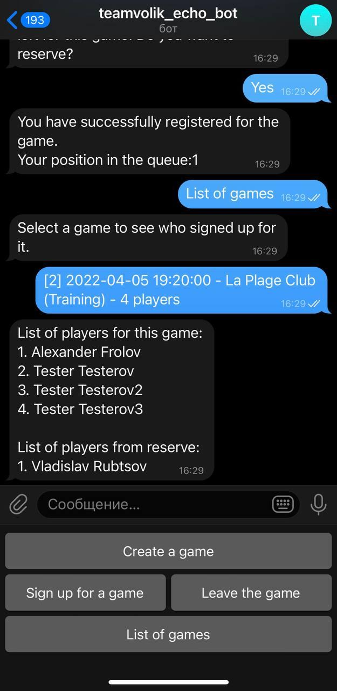
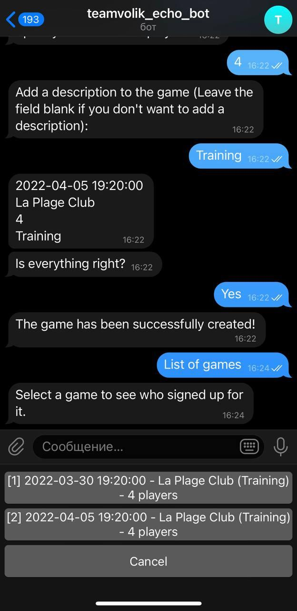

[](https://hitsofcode.com/github/teamvolik/teamvolik/view)
[](https://lgtm.com/projects/g/teamvolik/teamvolik/context:python)


# teamvolik telegram bot


Telegram bot, which greatly simplifies registration for local beach volleyball games.

## What's inside:
- [x] Write a basic version of the bot with which you can:
  - Create games (for administrators);
  - Join games / leave games;
  - See information about games, etc.
- [ ] Add a payment system for paid games;
- [ ] Add optional player characteristics (pitch power, etc.) in order to build more balanced teams;
- [ ] Add additional features for convenient use of the bot;

## config.json
In order to make bot work, you need to put `config.json` file into `teamvolik/userdata/`.
Here is what you need to put into config file: 
```
{
  "token":  "<YOUR-TELEGRAM-TOKEN>",
  "admins": [<ADMIN-ID-1>, ...],
  "db_fname":  "<DATABASE-FILENAME>"
}
```

## Suggested solution tools

- Python3.10;
- Python modules:
  - python-telegram-bot;
  - sqlite3;
  - json;
  - pytz.
- Python linters:
  - flake8;
  - black;
  - pydocstyle.
- Python modules for testing:
  - unittest
  - codecov

## GUI



1. ```Create a game```: Pressing takes you to the menu for creating a new game.
2. ```Sign up for a game```: Pressing displays a list of games that have not yet passed and for which the user has not yet been registered, then the user can select the game he wants to sign up for.
3. ```Leave the game```: Clicking brings up a list of games that the user is registered to, then the user can select the game they want to leave.
4. ```List of games```: Displays a list of all available games, then the user can find out additional information about the game: which users have already signed up for this game, etc.

---



An example of how the game display looks like.